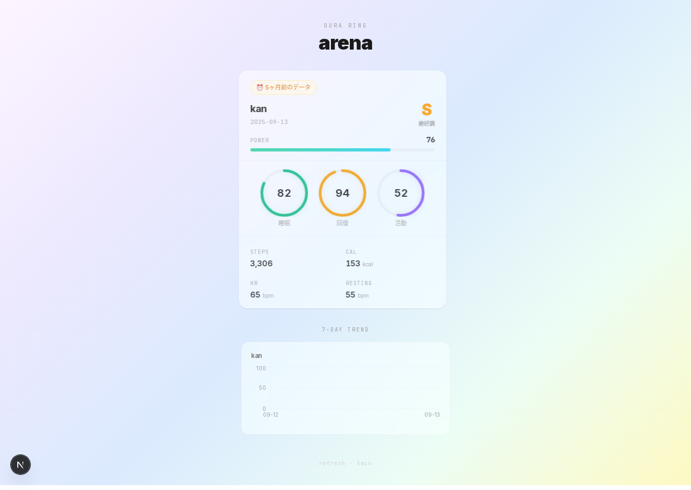
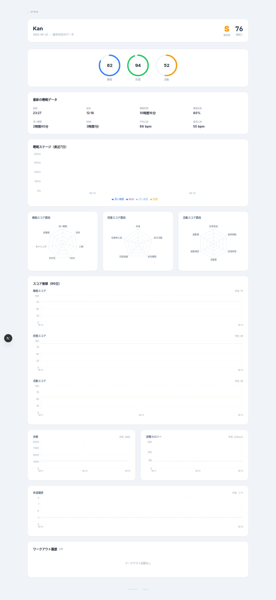

# Oura Arena

Oura Ring API v2 を使ったチームウェルネスダッシュボード。


## 開発者の健康状態

| 開発者 | 睡眠 | 回復 | 活動 | 戦闘力 | ランク |
|--------|------|------|------|--------|--------|
| Kan |  |  |  |  |  |
| Miyamae |  |  |  |  |  |

## プレビュー




## 機能

### ダッシュボード（トップページ）
- **スコアリング** — 睡眠・回復・活動スコアをリング表示
- **コンディション判定** — S/A/B/Cランク + 戦闘力で総合評価
- **バトルモード** — メンバー同士のVS表示、勝敗判定、勝利バナー
- **ミニメトリック** — 歩数・カロリー・心拍・安静時心拍をスパークライン付きで表示
- **7日間トレンド** — 睡眠＆回復スコアの推移チャート
- **古いデータ検出** — 最新データがない場合、過去365日まで自動探索

### 詳細ページ（`/user/[name]`）
- **睡眠分析** — 就寝/起床時刻の推移、睡眠時間、タイムライン、規則性スコア
- **睡眠ステージ** — REM/深い/浅い/覚醒の積み上げチャート
- **バイタルトレンド** — HRV・安静時心拍・呼吸数・中途覚醒回数（90日間）
- **レーダーチャート** — 睡眠/回復/活動のスコア要因分析
- **曜日別パターン** — 曜日ごとの平均スコア
- **パーソナルベスト** — 最高睡眠スコア、最多歩数、最長睡眠、最高HRV等
- **ワークアウト履歴** — アクティビティ一覧 + 時間帯散布図
- **体温偏差トレンド**
- **Gen4データ** — SpO2、ストレス、回復力、血管年齢、VO2 Max

### 称号システム
データから自動判定される称号。ホバーで取得条件を表示。

| 称号 | 条件 |
|------|------|
| 😴 安眠の達人 | 7日間平均睡眠スコア85+ |
| 🦉 夜更かしの帝王 | 7日間平均睡眠スコア50未満 |
| 🌙 早寝の鬼 | 平均就寝23時前 |
| 🌃 深夜族 | 平均就寝2時以降 |
| 💎 睡眠効率マスター | 平均効率92%+ |
| 🌊 深海の眠り手 | 平均深い睡眠90分+ |
| 💓 HRV王 | 平均HRV 80ms+ |
| 🚶 歩数マシーン | 7日間平均1万歩+ |
| 👟 ウォーカー | 7日間平均7000歩+ |
| 🔥 カロリーバーナー | 平均消費500kcal+ |
| 🏆 2万歩の壁突破 | 最高歩数2万歩+ |
| ⚡ 連勝街道 | 7日連続Good Sleep |
| 🎯 リズムキーパー | 就寝時刻のブレ30分未満 |
| 🌱 ルーキー | データ蓄積中 |

### 体調カレンダー（GitHub草風）
全期間の睡眠・活動スコアをGitHub Contributions風ヒートマップで表示。


### ストレスバトル
- ストレス時間 vs 回復時間を可視化
- 状態判定（🧘回復済み / 😌通常 / 😰ストレスフル）
- レジリエンス（回復力）レベル表示
- ※ Gen3以降のリングが必要

### GitHub連携
- **SVGカード** — `GET /api/card/[name].svg` でプロフィールREADMEに埋め込めるヘルスカード
- **バッジ** — `GET /api/badge/[name].svg?metric=sleep|readiness|activity|power|steps|rank`
- **称号バッジ** — `GET /api/badge/[name]/titles`
- **カレンダーバッジ** — `GET /api/badge/[name]/calendar?metric=sleep|activity&weeks=26`

```markdown


```

## セットアップ

### 1. Oura Personal Access Token を取得

[cloud.ouraring.com/personal-access-tokens](https://cloud.ouraring.com/personal-access-tokens) でトークンを作成。

### 2. 環境変数を設定

```bash
cp .env.example .env.local
```

`.env.local` を編集：

```
OURA_USERS=kan:YOUR_PAT,miyamae:THEIR_PAT
```

### 3. 起動

```bash
npm install
npm run dev
```

[localhost:3000](http://localhost:3000) を開く。

## Vercel デプロイ

1. リポジトリをGitHubにpush
2. [vercel.com](https://vercel.com) でインポート
3. 環境変数 `OURA_USERS` を追加
4. デプロイ

ISRで5分ごとにデータ更新。

## 技術スタック

- **Next.js 15** — App Router, Server Components
- **TypeScript**
- **Tailwind CSS v4**
- **Recharts** — チャート描画
- **Oura API v2** — 健康データ取得
